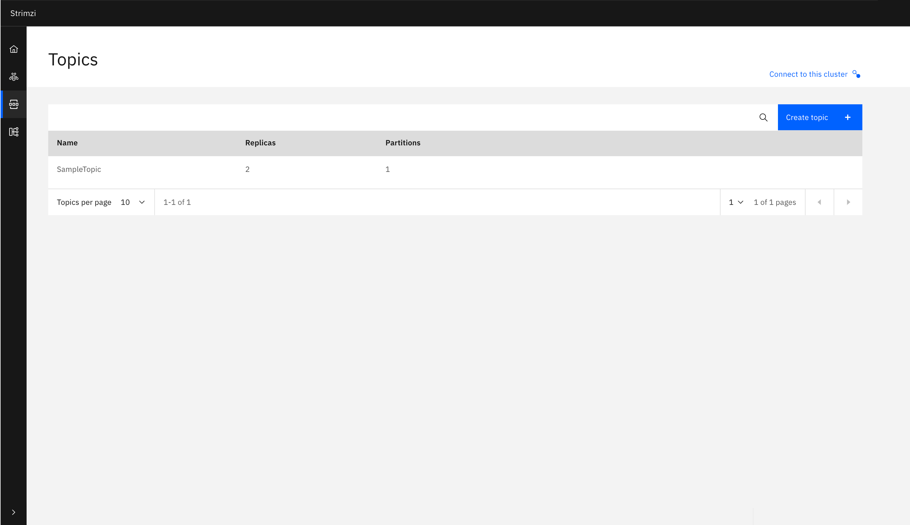
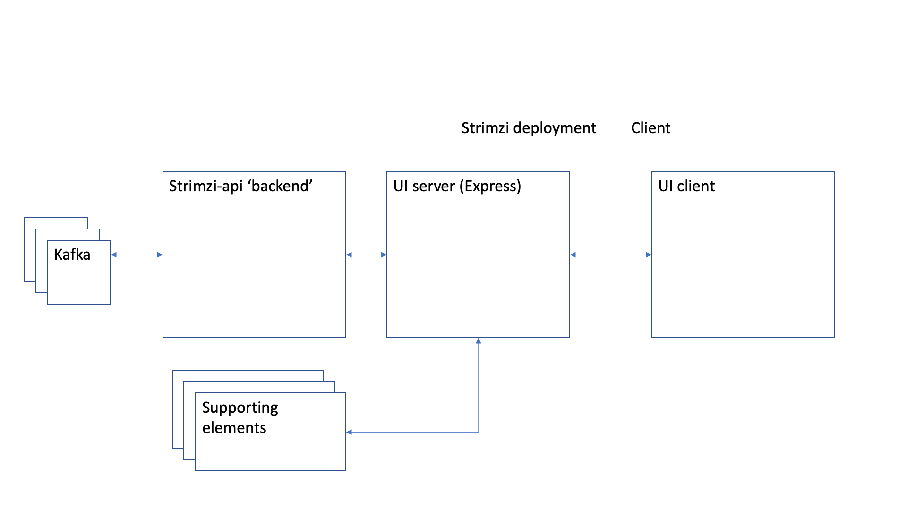
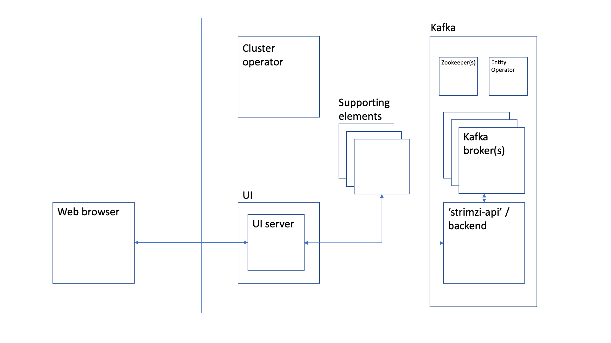

# Add a UI to Strimzi for Kafka Administration

This proposal is to add a Kafka administration UI to the Strimzi project.

## Motivation

Kafka out of the box provides a number of useful command tools to perform common administrative tasks such as creating topics, viewing consumer group status, and consuming record content. While these are helpful, they are not always the simplest or most convenient way of monitoring and performing administrative tasks on a Kafka cluster. In these cases a dedicated administration UI, focused on common administration tasks, would not only enable a user to complete their task more quickly and simply than previously possible, but also enable a more positive user experience of Kafka and its capabilities.

## Proposal

This proposal will describe a Kafka administration UI capability. It will describe example capabilities which could be offered, cover at a high level how the UI code itself could be implemented (with more low level detail to be provided as required), how this could be delivered, as well as possible future work and how this could integrate with Strimzi today.

### UI implementation

At a high level, I would propose a UI implemented as follows:

- It would be a Javascript based UI (using [babel](https://babeljs.io/) to provide latest ECMAScript capabilities in a cross browser compatible manner), using the [React](https://reactjs.org/) framework
- This UI is hosted and provided via an [Express](https://expressjs.com/) server
- This UI is built in a modular/metadata driven manner - allowing for easy extensibility, modification, and dynamic behaviour at runtime
- Uses a [GraphQL](https://graphql.org/) API
- Should be fully translatable, and accessible

I would suggest that the UI implementation to follow the [Model View Controller](https://en.wikipedia.org/wiki/Model%E2%80%93view%E2%80%93controller) (MVC) pattern, with clear separation between business logic, and the view logic that renders the state of the UI. This would enable/allow the view logic to be modified/swapped in/out as required, but keep the same business logic. I would suggest using the [Carbon](https://www.carbondesignsystem.com/) design system as the view layer for the contributed UI, given it is open source, is supported, and I can provide both the design and implementation using it. As an example, the following is a mock up of how a Topics page could look using the Carbon design system, which would allow a user to view, create, edit and delete topics in a given cluster:



By maintaining and enforcing a thin view layer, this should not stop other view layers being designed, implemented and contributed in other frameworks, such as [PatternFly](https://www.patternfly.org/v4/) or [Material](https://material.io/) for example.

I would also suggest using Express as a server for this UI. This is due to its small footprint, modularity and available 3rd party modules, such as [helmet for http security](https://helmetjs.github.io/), [Passport.js for authentication and authorization support](http://www.passportjs.org/) or [the graphql and express-graphql modules for GraphQL server support](https://graphql.org/graphql-js/running-an-express-graphql-server/).

This UI would also be provided with a full set of supporting elements - such as end to end tests, automation (examples of which are [in this section](#a-ui-repository-and-ways-of-working-in-the-repository)) to manage common tasks, and documentation around implementation approach, UI best practise and so on.

The below shows how these pieces could integrate.



Where:

- 'strimzi-api' is a backend server for Kafka data/requests
- 'Supporting elements' could be other Kafka related deployments such as Mirror Maker, Kafka Connect and Cruise control. These could also be non Kafka related deployments (not deployed as a part of Strimzi), such as LDAP servers, metric stores etc.

### A UI repository, and ways of working in the repository

In addition to the implementation detailed above, I would propose that any UI contributed to Strimzi be managed and developed as follows:

- Be developed in a dedicated repository inside the Strimzi Github organisation
- Both the UI server and client are contained in this repo - worked as sub modules in a monorepo
- That design/discussion/implementation and defect issues are kept solely in this repository
- All development is done in a behavioural manner - focusing on the end user, and the task they are trying to achieve (see [topic list](#topic-list-page) for an example)
- That the repository operate in a cloud like CI/CD manner; lots of small/little and often deliveries of new function, appropriately sized and gated, allowing for the UI to be shipped at any time
- That automation, such as [GitHub actions](https://github.com/features/actions) for example, is used as much as possible to support this CI/CD model - eg, automated dependency updates, automated testing run on PR, issue triage etc

### Phased delivery

A UI is more than just what a user sees. It also needs to be supported by backend data, services, and resources. To this end, and in bearing in mind the cloud development model mentioned above, all UI capability (both front and backend) should be provided in a phased manner. [I would suggest initially that a topic listing page is the first deliverable](#topic-list-page), but before that can happen, [prerequisites](#prerequisites) need to be discussed, agreed and implemented.

#### Prerequisites

In order to provide any UI, the whole stack which will support it will need to be discussed and considered. This will include (but not be limited to):

- Setting up the required UI build/packaging for deployment to Strimzi
- [Integrating the UI with Strimzi itself](#proposed-deployment)
- A Kafka backend server for Kafka data/requests the UI server can call
- UI server configurability/capability - including aspects such as;
  - Transport security
  - User session, authentication and authorization capabilities
  - Cluster metadata - listener addresses, number of brokers, etc
  - Maintenance/tracing support
- UI client side capabilities
  - State design
  - Configuration/capability discovery from the server
  - Routing and navigation logic
  - Maintenance/tracing capabilities

I am more than happy to elaborate and collaborate on any of these points here, and would suggest these (and any follow items identified while discussing this proposal) are completed before any client side UI work begins.

#### Topic list page

Given the prerequisites are satisfied, the first user task I would suggest is implemented is a listing of all the topics (along with partition and replica information per topic) in a given cluster. This will exercise all the prerequisites, as well as offer a user of Strimzi a new way to interact with their deployment. Using a [gherkin](https://cucumber.io/docs/gherkin/reference/) behavioural syntax to describe the capability, it would:

```
Scenario: Seeing all available topics:

Given I am a user of the UI
When I navigate to the topic listing
Then see all topics in my Kafka cluster

Scenario: Viewing a specific topic (when it exists in the cluster):
Given I am a user of the UI
When I navigate to the topic listing
And I filter for topic 'SampleTopic'
Then I see topic 'SampleTopic' in the topic list
And Topic 'SampleTopic' has '3' partitions and '2' replicas

Scenario: Viewing a specific topic (when it does not exist in the cluster):
Given I am a user of the UI
When I navigate to the topic listing
And I filter for topic 'SampleTopic'
Then I am told topic 'SampleTopic' does not exist in the cluster
```

#### Follow on capabilities

Additional Kafka capabilities which could be added later include (but would not be limited to):

- Create, update and delete topics on the topics list page (recontextualised as a Topics page - as per mock up)
- View Consumer group status for a given topic, or the whole cluster
- View the Brokers in a given cluster, their configuration, and where appropriate, allow modification of broker configuration
- Provide details of Kafka listener/bootstrap addresses, along with sample configuration, to allow streamline client connectivity

If desired, additional Strimzi provided capabilities, such as Kafka Users, could be leveraged/added/managed through this UI also (for example, allowing access to the UI and its capabilities, general CRUD updates to them etc). 

Finally, one capability which may be of interest (which may have bearing on how this is surfaced in Strimzi itself) is having a single UI, which can manage multiple Kafka clusters deployed via the Strimzi operator.

In all of these cases, capabilities can be added in a prioritised order, and should be added in a phased manner themselves (for example, add a view of the brokers and their configuration, then the ability to modify select configuration).

#### Proposed deployment

*EDIT*: This is being reviewed and will be revised given the community meeting (on 16/07/2020) discussion around the deployment options and security model ([minutes](https://docs.google.com/document/d/1V1lMeMwn6d2x1LKxyydhjo2c_IFANveelLD880A6bYc).

This UI could be deployed as a part of Strimzi as follows:



Where:

- The UI is deployed standalone, akin to how the Kafka bridge, Kafka Connect are currently for example (so a new CRD would be required, with configuration needed to reference which cluster(s) to interact with).
- The UI's spec would contain 0 to N Kafka clusters the UI will operate against, which will: 
  - Contain 1 or more 'backend' entries. These represent backend sources of data which can be surfaced in the UI.
    - One of these entries will be the `strimzi-api` (ie each Kafka kind will contain its own api server).
  - Each of these entries will define items such as the address to use to connect to it, any auth credentials required, Transport security required, etc.
- The UI's spec will contain general configuration for the UI - such as certificates to expose to clients etc.

This could look as follows in a CR configured by a user (note that common fields such as image, or readiness and liveness probes have been omitted here for conciseness, but would be present in a full CR).:

```
...
spec:
  clientCert: <mounted TLS cert> # (1)
  clusters:
  - name: 'dev-cluster' # (2)
    uiConfig: <mounted config map> # (3)
    backend:
    - name: 'strimzi-api' # (4)
      address: 'https://route-to-strimzi-api-for-dev-cluster:port' # (5)
      version: 1 # (6)
      tls: # 7
        cert: <mounted tls certificate>
        version: TLS_1.3
...
```

Where:

1. Optional, certificate used between client and UI server. If omitted, UI server will serve via http rather than https.
2. Required, string - the name of this cluster. Should be the same value as `metadata.name` in the Kafka CR.
3. Optional, a config map containing JSON. If provided, values in this config map will override default configuration values.
4. Required, string - a unique identifier of this 'backend'.
5. Required, string - endpoint address for this backend.
6. Required, integer - the version of the API this UI will use.
7. Optional, object. Contains tls configuration (certificate to use, protocol versions etc. If omitted, traffic between these two endpoints will be in the clear.

I am suggesting this approach for the following reasons:

- It follows the model of similar supporting capabilities currently available in Strimzi
- It allows for multiple Kafka clusters to be managed via a single UI (a potential future work item)

This approach does have a few assumptions. These being:
- A `strimzi-api` being deployed as a part of the Kafka cluster (ie one per namespace/cluster). This deployment is then referenced in the UI's CR (as above). 
- A handshake/metadata exchange will be required for the UI to discover and integrate with each backend. I expect this exchange to be the retrieval of a GraphQL schema, so they can be combined/unified by the UI server, as well as any other metadata appropriate to that backend (eg Kakfa version of the cluster a `strimzi-api` is configured to use).
- The backend's registered with the UI will need to be version aware and backwards compatible - ie version 2 of an api also needs to support the version 1 api.
- Both the UI, and any backend requiring authentication and authorization (eg `strimzi-api`) will need to align on how authentication and authorization will work. My suggestion would be to have a separation between resources (eg topics) and actions upon them, and the backing implementation which represent/persist them. As shown above, this could be provided via KafkaUsers, or other mechanisms, such as OAuth.

I would also suggest a name from the CRD of `kafka-web-ui`.

## Affected projects

I would expect that the main development effort for a UI will be in a new repository in the Strimzi Github organisation. However, given the discussion in https://github.com/strimzi/strimzi-kafka-operator/issues/2540 , one option to source backend Kafka data would be via the [Bridge](https://github.com/strimzi/strimzi-kafka-bridge). As required, this could be extended to support the various Kafka backend calls needed to surface any required information in a UI. In addition, depending on how and where the UI is provided in Strimzi, changes may be needed in the [strimzi-kafka-operator](https://github.com/strimzi/strimzi-kafka-operator) to either define a UI CRD, or deploy a UI deployment if configured to do so via the operator. I would very much welcome discussion around this, and what would make the most sense for the Strimzi project.

## Rejected alternatives

- A Vert.X based UI Server: The server hosting the static files for a UI will also need to support the UI in number of ways. It may need to do session management, enforce security, process responses and perform other general logic. In my experience, Express can be easily augmented to have these capabilities (and more) in a highly configurable manner, while maintaining a small footprint (vs say a whole JVM) and performance. Generally speaking as well, it is part of the defacto stack for React UIs, alongside things like Webpack for build.

## Proposed next steps

- Discuss and iterate the proposal
- Offer (as a draft PR into an appropriate repository) low level design documentation for a UI, covering architecture, build, test, for further review
